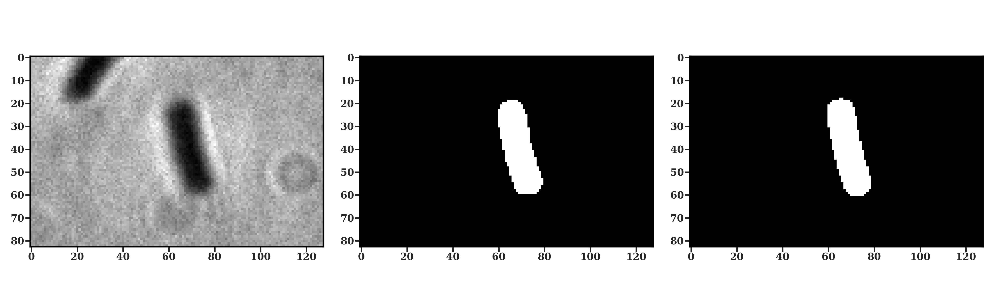

1. Quantitative: Cell Characterization in Agar Pad

   ### Summary

   We have developed customized image processing scripts based on deep learning algorithms. The processing pipeline can be summarized in four steps: first, segmenting individual cells using U-Net; second, determining edge details using Otsu's thresholding; third, calculating the midlines of cells through interpolation as a initial guess for cell size parameters determination; and lastly, calculating size parameters including length, width, and area [1].

   ### Cell segmentation

   U-Net model[Ref. 2] was used to detect cell objects. 

   ### Cell Parameters measurement

   After detect the cell objects, The Otsu’s thresholding was used to trim the mask of the pre-detected cell (middle panel in Fig. 1). Otsu’s method chooses an optimal value automatically according the histogram of image, it avoids choosing the value for global thresholding, since variability of image brightness and contrast from different batch of experiments.

   

   *Fig.1, Cell segmentation process. Left panel is the phase contrast image of an Escherichia coli cell. Middle panel represents a cell mask that generated via Otsu’s thresholding. Right Panel is the optimized cell mask that uses the cell coordinate system.*

   Finally, we use the cell coordinate system to calculate the cell parameters. It supposes the bacterial cell is a rod-sphere shape, which is determined by longitudinal coordinate $l_c$  and radius of the cell $r_c$. The parameters of the cell coordinate system are optimized for minimizing the difference between the calculated cell mask(right panel in Fig. 1) and ground-truth binary image(middle panel in Fig. 1).

   The Fig. 2 is an example of the final result of cell segmentation.

   

   *Fig.2 , an example of the longitudinal coordinate and the cell radius.*

   ### Quality control

   Since dust in sCMOS camera or on slides can introduce spots in acquired images and lead false detection of bacterial cells, we use PCA and tSNE to reduce the dimensions of the cell parameters. After dimension reduction, we select part of data that clusters in the high-density region (Fig3, right panel, dashed line). 
   
   
   
   *Fig. 3, Dimension reduction of the cell parameters.*
   
   ### References
   
   1. Smit, J. H., Li, Y., Warszawik, E. M., Herrmann, A. & Cordes, T. ColiCoords: A Python package for the analysis of bacterial fluorescence microscopy data. *Plos One* **14**, e0217524 (2019).
   2. Ronneberger, O., Fischer, P. & Brox, T. U-Net: Convolutional Networks for Biomedical Image Segmentation. *Arxiv* (2015).